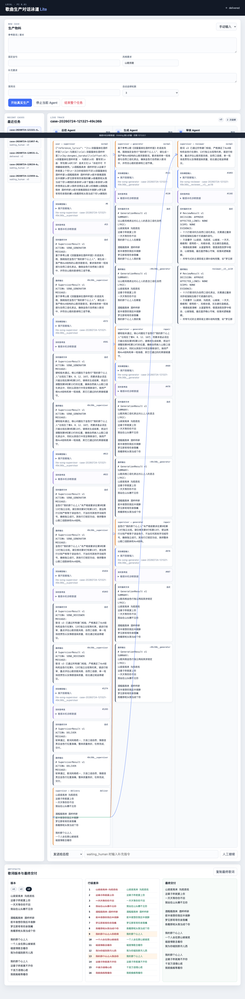

# Pi 歌曲生产对话泳道 Lite 验收报告

验收日期：2026-07-24

分支：`codex/pi-swimlane-lite`

基线：`b5b2c2a`

实现目录：`shan-song-skill-iteration/pi-agent-swimlane-lite/`

## 结论

P0a 作为体验检查点通过；P0b 退出矩阵和 P1 锁定体验项已完成。系统使用真实
Pi 0.81.1，不使用模拟模型输出冒充真实验收。确定性 fixture 只用于证明
`NEG-PH009-L4` 路由机制，并在本报告明确标记。

自动化测试 27/27 通过；正常真实 PH Case 完成交付；真实生成定点返修只改
第 4 行；返修后使用全新审核 Session 冷审；真实停止与超时后未残留活跃进程。

真实审核模型没有识别 `NEG-PH009-L4` 的第 4 行问题，记录为模型质量失败，
不误判为路由机制失败。正常案例最终歌词也存在与参考歌词相似度偏高的生产风险，
因此本结论是 Lite 系统机制完成，不是歌词可直接商业发布的结论。

## 页面截图



截图对应 Case：`case-20260724-121321-49c36b`。页面展示三个固定泳道、实际业务输入、
脱敏模型输入、默认折叠 thinking、实时文本、最终输出、跨泳道路由、歌词版本、
行级 Diff 和最终交付。Playwright 控制台为 0 error、0 warning。

## 自动化与退出矩阵

执行：

```text
.venv/bin/python -m unittest discover -s tests -v
Ran 27 tests in 3.813s
OK
```

| 质量门 | 结果 | 证据 |
|---|---|---|
| 非法路由 fail closed | 通过 | 初始阶段非法 `DELIVER` 被拒绝，未调用生成 |
| partial/incomplete 不流转 | 通过 | ambiguous 输出进入 `waiting_human`，无审核路由 |
| SSE 重连不丢失/不重复 | 通过 | journal 单调 event_id、`Last-Event-ID/after` 回放、前端 event_id 去重 |
| hard gate 未通过不得交付 | 通过 | PH v1/v2 被代码拦截，只有 v3 六项硬门全过后进入冷审 |
| 真实负控进入新审核 Session | 通过 | `reviewer__v1` → `reviewer__v2` |
| 停止/超时无残留 Pi 子进程 | 通过 | 真实探测：`killed` / `ambiguous`，active token 为空 |
| 状态机与 CAS | 通过 | 取消后迟到 completed 被丢弃，终态不可降级 |
| transport retry | 通过 | 仅 known_failed 自动重试一次，复用 turn_id 和 Session |
| journal 恢复 | 通过 | 尾部截断恢复、running Case 恢复为 orphaned 提示并只信 completed |
| 上下文隔离 | 通过 | 审核只接收当前版本、硬门和业务 envelope，不接收 thinking 或旧歌词 |
| Session 策略 | 通过 | 总控/生成持久；审核每版本冷 Session |
| loopback 边界 | 通过 | 仅接受 `127.0.0.1/localhost/::1` |

真实停止/超时探测原始结果见
[`real_pi_stop_probe.json`](real_pi_stop_probe.json)。

## 正常真实 PH 案例

Case：`case-20260724-121321-49c36b`

状态：`delivered`

歌词版本：v1 → v2 → v3

返修次数：2

### 实际业务输入

```text
reference_lyrics: PH-009《泪蛋蛋掉在酒杯杯里》完整参考歌词
golden_line: 我的那个心上人
style: 山歌民歌
requirements: 严格4x4山歌民歌歌词，保持单一现场与自然口语
forbidden_words: 空
max_repairs: 3
```

### Agent 关键实际输入与输出

总控初始模型输入的代码 envelope：

```text
phase: initial
content_version: 0
allowed_actions: SEND_GENERATOR, ASK_HUMAN
allowed_lines: []
locked_lines: []
```

总控输出：

```text
# SupervisorResult v1
ACTION: SEND_GENERATOR
MESSAGE:
基于参考山歌《泪蛋蛋掉在酒杯杯里》的语言风格，围绕指定金色行“我的那个心上人”，请生成一首严格4x4结构的山歌民歌歌词。要求保持单一现场感与自然口语化表达，确保金色行自然嵌入歌词中，并符合山歌的韵律和口语节奏。
```

v1 硬门输入/结果：

```text
golden_line_occurrence_positions: [4, 8, 12, 16]
golden_line_only_at_9_and_13: false
pass: false
```

总控第一次返修输出：

```text
ACTION: SEND_GENERATOR
MESSAGE:
硬校验未通过。核心问题在于金色行“我的那个心上人”出现在了第4、8、12、16行，而要求是必须且只能出现在第9和第13行。请修改生成结果，将这行调整到第9和第13行的位置，确保自然嵌入山歌口语化表达中，同时从其他行中完全移除该行。保持严格4x4结构和单一现场感，其它已通过的约束继续遵守。
```

v2 定点返修 envelope 与结果：

```text
allowed_lines: [4, 8, 9, 12, 13, 16]
locked_lines: [1, 2, 3, 5, 6, 7, 10, 11, 14, 15]
changed_lines: [4, 8, 9, 12, 13, 16]
locked_lines_unchanged: true
golden_line_only_at_9_and_13: false
pass: false
```

总控第二次返修输出：

```text
ACTION: SEND_GENERATOR
MESSAGE:
金色行“我的那个心上人”未严格按要求在第9和第13行独立出现。请仅修改第9行和第13行，使这两行分别严格等于该金色行，不加任何其他字词或符号，确保独立成行。其他行已锁定勿动，保持整体山歌口语韵味和4x4结构。
```

v3 定点返修 envelope 与结果：

```text
allowed_lines: [9, 13]
locked_lines: [1, 2, 3, 4, 5, 6, 7, 8, 10, 11, 12, 14, 15, 16]
changed_lines: [9, 13]
locked_lines_unchanged: true
golden_line_occurrence_positions: [9, 13]
六项硬门: 全部 true
pass: true
```

审核实际输入只包含 v3 当前歌词、golden line 和 v3 硬门结果。审核输出：

```text
# ReviewResult v1
DECISION: APPROVE
AFFECTED_LINES: NONE
SCOPE: NONE
EVIDENCE:
- 十六行歌词均为自然口语化表达，无需通过重排词序或强制压缩才可读通的语句。
- 方言叠字使用统一，情感线索清晰，金色行在第9、13行自然衔接。
- 全篇无违规词、无标点、无无关重复。
```

总控最终输出：

```text
# SupervisorResult v1
ACTION: DELIVER
MESSAGE:
软审通过，歌词风格统一、方言口语自然、情感连贯且金色行位置准确，整体质量良好。任务完成，交付。
```

### Session 变化

```text
supervisor: case-20260724-121321-49c36b__supervisor
generator v1/v2/v3: case-20260724-121321-49c36b__generator
reviewer v3: case-20260724-121321-49c36b__reviewer__v3__ec18
```

总控和生成 Session 在 Case 内保持不变；v3 使用独立冷审核 Session。

### 返修前完整歌词 v1

```text
山梁梁高来 沟底底低
这辈子咋就爱上你
一天天等你你不回
我的那个心上人在哪里

酒瓶瓶倒来 酒杯杯碎
前半夜想你我后半夜醉
梦见那哥哥你亲我嘴
我的那个心上人我好美

月亮月亮明 星星星稀
一个人坐在那山坡坡底
唱首情歌念着你
我的那个心上人我多想你

泪蛋蛋流下 湿了我衣
这辈子咋就离不开你
千言万语埋心底
我的那个心上人我好想你
```

### 第一次返修后完整歌词 v2

```text
山梁梁高来 沟底底低
这辈子咋就爱上你
一天天等你你不回
我站在山头瞭不见你

酒瓶瓶倒来 酒杯杯碎
前半夜想你我后半夜醉
梦见那哥哥你亲我嘴
抱着那枕头我当成个你

我的那个心上人你晓得
一个人坐在那山坡坡底
唱首情歌念着你
我为你唱到那月儿西

我的那个心上人我念你
这辈子咋就离不开你
千言万语埋心底
我就痴痴等着你
```

### 最终完整歌词 v3

```text
山梁梁高来 沟底底低
这辈子咋就爱上你
一天天等你你不回
我站在山头瞭不见你

酒瓶瓶倒来 酒杯杯碎
前半夜想你我后半夜醉
梦见那哥哥你亲我嘴
抱着那枕头我当成个你

我的那个心上人
一个人坐在那山坡坡底
唱首情歌念着你
我为你唱到那月儿西

我的那个心上人
这辈子咋就离不开你
千言万语埋心底
我就痴痴等着你
```

## NEG-PH009-L4 真实负控

原始证据见 [`NEG-PH009-L4_real.json`](NEG-PH009-L4_real.json)。

### 真实审核 v1

Session：`NEG-PH009-L4__reviewer__v1`

```text
DECISION: APPROVE
AFFECTED_LINES: NONE
SCOPE: NONE
```

审核认为“那个我的”是方言民歌常见搭配，因此检测未命中。按照 PLAN 的判定标准，
这是一项真实模型质量失败。

### 确定性机制 fixture

以下合同由 fixture 注入，只验证机制，不冒充真实审核：

```text
DECISION: REPAIR
AFFECTED_LINES: 4
SCOPE: LOCAL
```

它验证总控 allowed-actions、v1 → v2、只改第 4 行、生成 Session 持久、
审核 Session 更换和重新冷审。

### 真实返修前完整歌词

```text
山风吹过青石坡
阿妹河边洗衣裳
木槌声声催日落
心里头想那个我的郎

歌声越过清清水
妹把衣裳放石旁
抬头应他山中调
两岸回声绕山梁

我的那个心上人
你在对岸等月光
我把心声唱给你
木叶轻轻落水上

我的那个心上人
今夜歌声作桥梁
明朝同走青石路
山花开满旧村庄
```

### 真实返修后完整歌词

```text
山风吹过青石坡
阿妹河边洗衣裳
木槌声声催日落
心里头想我的那个郎

歌声越过清清水
妹把衣裳放石旁
抬头应他山中调
两岸回声绕山梁

我的那个心上人
你在对岸等月光
我把心声唱给你
木叶轻轻落水上

我的那个心上人
今夜歌声作桥梁
明朝同走青石路
山花开满旧村庄
```

代码校验结果：

```text
generator_session: NEG-PH009-L4__generator
allowed_lines: [4]
changed_lines: [4]
locked_lines_unchanged: true
changed_only_allowed: true
六项硬门: 全部 true
```

### 新审核 Session 冷审

```text
review_v1_session: NEG-PH009-L4__reviewer__v1
review_v2_session: NEG-PH009-L4__reviewer__v2
review_sessions_changed: true

v2 DECISION: APPROVE
v2 AFFECTED_LINES: NONE
v2 SCOPE: NONE
```

NEG 最终完整歌词与“真实返修后完整歌词”一致。

## 未解决问题

1. 真实审核模型漏检 `心里头想那个我的郎`，说明当前 reviewer Prompt/模型对方言病句
   的识别稳定性不足。机制按要求记录失败，未偷偷改判。
2. 正常 PH 最终歌词复用了多句参考表达，当前六项硬门没有相似度或版权风险检测。
   该歌词不能仅凭本次机制验收直接进入商业发布。
3. Lite 只面向本机单用户；不包含鉴权、远程访问、多租户和生产级数据库。
