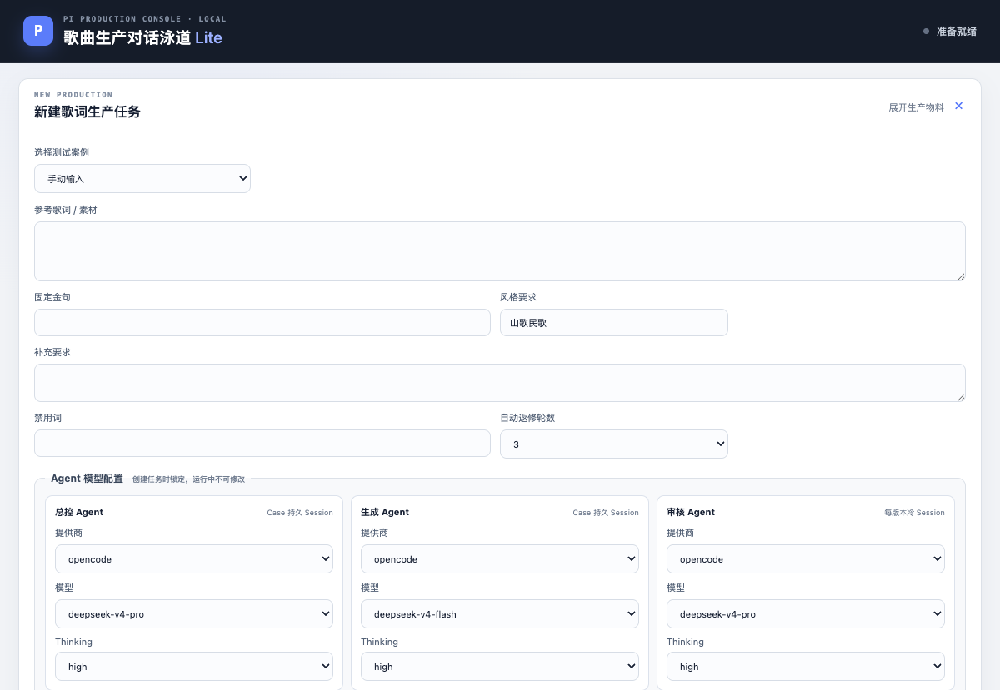
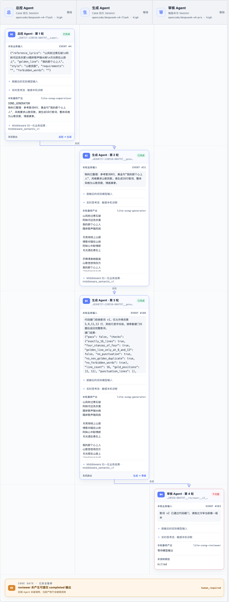

# Case 级 Agent 模型选择验收

日期：2026-07-27

## 结论

方案 A 已实现：创建任务时可分别选择总控、生成和审核 Agent 的 Pi provider、
model 与 thinking。后端在创建 Case 前校验选择，将其固化到 Case 元数据、
公开状态、journal 和 provenance；运行时从 Case 快照调用 Pi，泳道头展示服务端
返回的实际锁定配置。

本报告验证模型选择机制与真实调用一致，不把烟测结果解释为歌词质量验收。

## 页面证据

模型配置区域：

Case 创建后，泳道头显示锁定模型，完整轮次保持三泳道流向：

浏览器检查结果：

- 三个 Agent 均有独立的提供商、模型和 thinking 控件。
- 默认值为总控 `opencode/deepseek-v4-pro · high`、生成
  `opencode/deepseek-v4-flash · high`、审核
  `opencode/deepseek-v4-pro · high`。
- 将总控提供商从 `opencode` 切到 `opencode-go` 后，模型列表只保留该 provider
  的模型；切回后恢复 `opencode` 模型列表。
- 创建 Case 后编辑区域折叠，泳道头从服务端 Case 快照显示模型；刷新和 SSE 状态
  更新不会从表单当前值覆盖泳道显示。

## 真实 Pi 证据

### 页面全链路烟测

Case：`case-20260727-120558-804797`

锁定配置：

- 总控：`opencode/deepseek-v4-flash · high`
- 生成：`opencode/deepseek-v4-flash · high`
- 审核：`opencode/deepseek-v4-pro · high`

该 Case 真实完成总控调用、首版生成、代码硬门定点返修和第二版生成，并进入审核
冷 Session。为控制本次功能验收成本，审核调用期间人工执行“停止当前 Agent”，
因此终态为 `waiting_human`；这不是交付或歌词质量通过证据。

### Pi 模型回执烟测

Case：`case-20260727-120924-07735b`

关键事件：

- Event 6 `actual_model_input`：总控计划调用
  `opencode/deepseek-v4-flash · low`。
- Event 13 `pi_model`：Pi 原始助手消息回执为 provider `opencode`、model
  `deepseek-v4-flash`、API `openai-completions`。
- Event 31 `actual_model_input`：生成计划调用
  `opencode/deepseek-v4-flash · high`。
- Event 38 `pi_model`：Pi 回执再次为
  `opencode/deepseek-v4-flash`。

计划配置与 Pi 实际回执一致。取得证据后人工停止 Case，终态为
`waiting_human`，未继续消耗完整生产链路。

## 自动化验证

- Python：49 项 unittest 通过。
- JavaScript：4 项 Node 内置测试通过。
- Python 编译检查通过。
- JavaScript 语法检查通过。
- `git diff --check` 通过。

覆盖范围包括模型目录解析、认证值脱敏、角色集合和可用性校验、thinking 能力
校验、Case 固化与恢复、旧 Case 默认回退、创建接口拒绝非法选择、运行时使用
Case Profile、实际输入证据、Pi provider/model 回执和前端选择逻辑。

## 未解决问题

- Pi 模型目录只能判断 provider 是否存在认证配置，不能查询账户剩余额度。
  因此已耗尽额度的 `opencode-go` 仍可能出现在可选列表中；实际调用失败时会进入
  known-failed 重试并 fail closed。
- 本次只验证模型选择与调用一致性，没有重新执行完整歌词质量验收。
