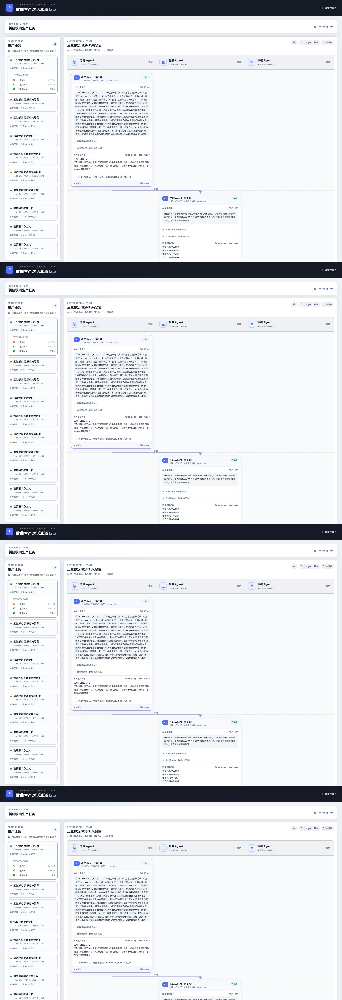
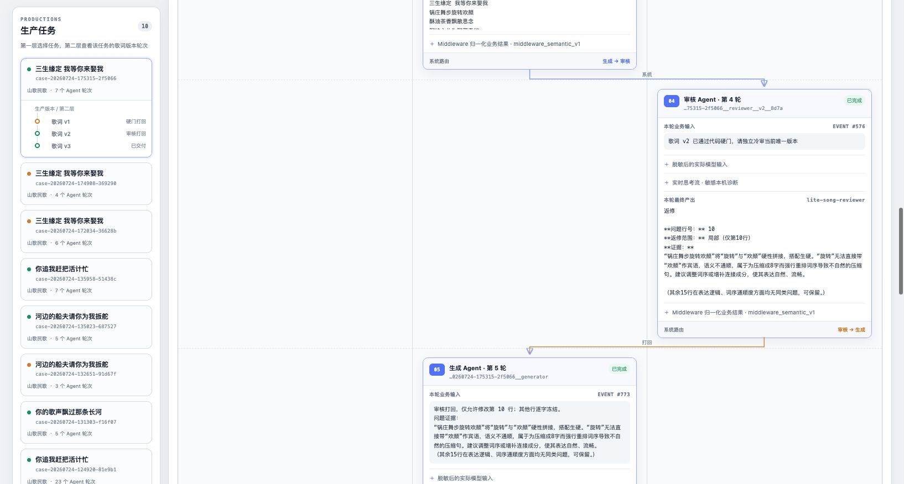
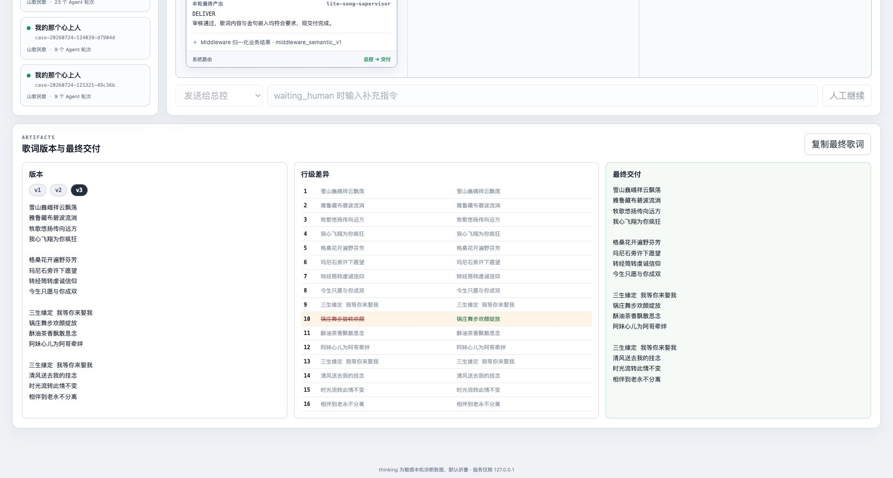

# 业务输出语义适配修复验收

验收时间：2026-07-24  
分支：`codex/pi-swimlane-lite`  
机制提交：`0458f9b`  
自然段兼容提交：`e89eba1`  
真实 Pi：`0.81.1`  
真实 Case：`case-20260724-175315-2f5066`

## 结论

修复通过。Agent 不再需要输出精确字段顺序、版本标题或固定换行格式：

- 总控只需明确一个动作，其他内容自然表达。
- 生成只需输出唯一一份完整歌词。
- 审核只需表达通过，或表达返修、问题行、范围和证据。
- Middleware 将自然文本、旧格式、JSON 和常见 Markdown 归一化为代码对象。
- 只有业务语义缺失、冲突或无法唯一确定时才阻断。
- 六项歌词硬门、路由白名单、定点返修冻结校验和交付否决权未放宽。

真实 Case 最终状态为 `delivered`，共 3 个歌词版本、2 次返修、7 个 Agent
轮次；7 次业务输出全部完成归一化，`contract_invalid=0`，
`semantic_output_invalid=0`。

## 页面截图

完整泳道：



审核自然输出被归一化并直接打回生成：



第 10 行定点 Diff 和最终交付：



## 实际路由

1. 用户 → 总控
2. 总控 → 生成
3. 硬门 → 生成（v1 金句位置不合格）
4. 生成 → 审核（v2）
5. 审核 → 生成（仅第 10 行）
6. 生成 → 审核（v3，新审核 Session）
7. 审核 → 总控
8. 总控 → 交付

生成结果没有先回总控；只有独立冷审通过后才回到总控终审。

## Agent 关键实际输入和输出

### 总控首轮

实际业务输入：参考物料、固定金句 `三生缘定 我等你来娶我`、风格
`山歌民歌`、空禁用词和最大返修次数。

实际模型输出：

```text
SEND_GENERATOR
任务摘要：基于参考歌词《玛尼情歌》的风格和主题，创作一首新的山歌民歌风格歌词，需自然融入金句"三生缘定 我等你来娶我"。无额外要求或禁用词约束，请自由生成整首歌词。
```

Middleware 归一化动作：`SEND_GENERATOR`。

### 生成首轮

实际业务输入：总控的自然语言任务摘要及完整参考素材。

实际模型输出即下方 v1 完整歌词，没有 `GenerationResult` 模板。

代码硬门发现固定金句只在第 16 行，要求只修改第 9、13、16 行；没有调用
总控或审核。

### 审核 v2

实际业务输入：

```text
歌词 v2 已通过代码硬门，请独立冷审当前唯一版本
```

实际模型输出：

```text
返修

**问题行号：** 10
**返修范围：** 局部（仅第10行）
**证据：**
“锅庄舞步旋转欢颜”将“旋转”与“欢颜”硬性拼接，搭配生硬。“旋转”无法直接带“欢颜”作宾语，语义不通顺，属于为压缩成8字而强行重排词序导致不自然的压缩句。建议调整词序或增补连接成分，使其表达自然、流畅。

（其余15行在表达逻辑、词序通顺度方面均无同类问题，可保留。）
```

Middleware 归一化结果：

```json
{
  "decision": "REPAIR",
  "affected_lines": [10],
  "scope": "LOCAL"
}
```

### 生成定点返修

实际业务输入：

```text
审核打回，仅允许修改第 10 行；其他行逐字冻结。
```

实际模型输出即下方 v3 完整歌词。代码校验结果：

```json
{
  "allowed_lines": [10],
  "changed_lines": [10],
  "locked_lines_unchanged": true,
  "changed_only_allowed": true
}
```

### 审核 v3

实际业务输入：

```text
歌词 v3 已通过代码硬门，请独立冷审当前唯一版本
```

实际模型输出：

```text
通过。全篇16行在已确认格式合规的前提下，内容通顺自然，没有生硬压缩或需重排词序才可理解的句子。第5行“格桑花开遍野芬芳”及第7行“转经筒转虔诚信仰”虽略具压缩感，但在歌词语境中均属合理省略/并置，阅读无障碍；第9、13行golden line嵌入流畅，人物视角统一（女性口吻），情感递进清晰。无需返修。
```

Middleware 归一化为 `APPROVE / NONE / NONE`。

### 总控终审

实际业务输入：

```text
歌词 v3 冷审通过，提交总控终审
```

实际模型输出：

```text
DELIVER
审核通过，歌词内容与金句嵌入均符合要求，现交付完成。
```

代码再次校验动作合法且硬门通过后才交付。

## 完整歌词版本

### v1：硬门返修前

```text
雪山巍峨祥云飘荡
雅鲁藏布碧波流淌
牧歌悠扬传向远方
我心飞翔为你疯狂

格桑花开遍野芬芳
玛尼石旁许下愿望
转经筒转虔诚信仰
今生只愿与你成双

高原篝火点亮夜晚
锅庄舞步旋转欢颜
酥油茶香飘散思念
阿妹心儿为阿哥牵绊

明月见证我的誓言
清风送去我的挂念
时光流转此情不变
三生缘定 我等你来娶我
```

### v2：审核返修前

```text
雪山巍峨祥云飘荡
雅鲁藏布碧波流淌
牧歌悠扬传向远方
我心飞翔为你疯狂

格桑花开遍野芬芳
玛尼石旁许下愿望
转经筒转虔诚信仰
今生只愿与你成双

三生缘定 我等你来娶我
锅庄舞步旋转欢颜
酥油茶香飘散思念
阿妹心儿为阿哥牵绊

三生缘定 我等你来娶我
清风送去我的挂念
时光流转此情不变
相伴到老永不分离
```

### v3：审核返修后及最终交付

```text
雪山巍峨祥云飘荡
雅鲁藏布碧波流淌
牧歌悠扬传向远方
我心飞翔为你疯狂

格桑花开遍野芬芳
玛尼石旁许下愿望
转经筒转虔诚信仰
今生只愿与你成双

三生缘定 我等你来娶我
锅庄舞步欢颜绽放
酥油茶香飘散思念
阿妹心儿为阿哥牵绊

三生缘定 我等你来娶我
清风送去我的挂念
时光流转此情不变
相伴到老永不分离
```

v2 → v3 只有第 10 行变化：

```diff
- 锅庄舞步旋转欢颜
+ 锅庄舞步欢颜绽放
```

## Session 变化

- 总控两轮均为
  `case-20260724-175315-2f5066__supervisor`。
- 生成三轮均为
  `case-20260724-175315-2f5066__generator`。
- v2 审核为
  `case-20260724-175315-2f5066__reviewer__v2__8d7a`。
- v3 审核为
  `case-20260724-175315-2f5066__reviewer__v3__f46a`。

生成保持 Case Session，每个歌词版本使用新的审核 Session。

## 自动化机制测试

命令：

```bash
.venv/bin/python -m unittest discover -s tests
node --check static/app.js
.venv/bin/python -m py_compile app/*.py tests/*.py
git diff --check
```

结果：35 项 Python 测试通过，JavaScript 语法、Python 编译和 Git diff
检查通过。

覆盖项包括旧合同兼容、自然中文、JSON、Markdown、同行证据、自然段审核、
语义矛盾阻断、缺歌词阻断、非法路由阻断、partial/incomplete 阻断、定点冻结、
真实路由顺序、生成 Session 保持和每版本冷审 Session。

## 未解决问题

- 历史 Case 不自动重放，旧的 `waiting_human` 记录仍保留原始失败证据；修复只对
  新运行和人工重新调用生效。
- Middleware 只做确定性语义归一化，不代替内容审核；无法唯一识别两份歌词、
  互相冲突的动作或缺少问题行的返修仍会安全暂停。
- 当前硬门不包含参考歌词相似度和版权风险，最终歌词仍建议做人工生产审阅。
