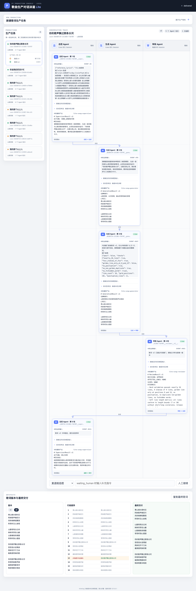

# 泳道流程与任务分层迭代验收

日期：2026-07-24

分支：`codex/pi-swimlane-lite`

## 修改结论

本轮根据体验反馈完成三项修改：

1. 主链路调整为“总控初始化 → 生成 → 审核 → 总控终审”。
2. 每个 Agent Turn 聚合为一张完整轮次卡片，统一展示业务输入、实际模型输入、
   thinking、最终输出、状态和下一跳。
3. 最近任务改为“生产任务 → 歌词版本轮次”两层；Case ID 降为技术辅助信息。

代码硬门仍位于生成与审核之间。硬门失败的非法歌词不会送审，而是由系统携带
代码拥有的允许行/冻结行直接返回生成。审核 `REPAIR` 同样直接返回生成；
只有审核 `APPROVE` 才进入总控终审。

## 页面截图



截图使用真实 Pi Case `case-20260724-131303-f16f07`。Playwright 控制台为
0 error、0 warning。

## 真实路由证据

```text
user       → supervisor  normal
supervisor → generator   normal
hard_gate  → generator   repair
generator  → reviewer    review
reviewer   → supervisor  approval
supervisor → delivery    deliver
```

本 Case 的 v1 金句只出现在第 9 行，被代码硬门直接退回生成；生成 v2 后直接送审核，
没有中间总控 Turn。审核通过后才调用总控终审。

Agent completed 顺序：

```text
总控 → 生成 → 生成返修 → 审核 → 总控终审
```

## 真实 Case 状态

```text
task_title: 你的歌声飘过那条长河
status: delivered
content_version: 2
repair_count: 1
turn_count: 5

v1: 硬门打回
v2: 审核通过并交付
```

Session：

```text
supervisor: case-20260724-131303-f16f07__supervisor
generator v1/v2: case-20260724-131303-f16f07__generator
reviewer v2: case-20260724-131303-f16f07__reviewer__v2__d84d
```

## 返修冻结证据

v1：

```text
青山绿水绕村庄
阿妹歌声响四方
风吹杨柳轻飘荡
阿哥听见心发慌

山路弯弯白云间
妹妹采茶在山巅
山歌嘹亮传情意
哥哥听到心里甜

你的歌声飘过那条长河
悠悠流水送情波
两岸花开千万朵
最美是阿妹的歌

夕阳西下红满天
阿哥阿妹歌声甜
唱得夜莺都来伴
相亲相爱永相连
```

v2 / 最终交付：

```text
青山绿水绕村庄
阿妹歌声响四方
风吹杨柳轻飘荡
阿哥听见心发慌

山路弯弯白云间
妹妹采茶在山巅
山歌嘹亮传情意
哥哥听到心里甜

你的歌声飘过那条长河
悠悠流水送情波
两岸花开千万朵
最美是阿妹的歌

你的歌声飘过那条长河
阿哥阿妹歌声甜
唱得夜莺都来伴
相亲相爱永相连
```

```text
allowed_lines: [9, 13]
changed_lines: [13]
locked_lines_unchanged: true
changed_only_allowed: true
六项硬门: 全部通过
```

## 自动化验证

```text
.venv/bin/python -m unittest discover -s tests -q
Ran 28 tests
OK
```

新增回归明确验证：

- 正常链路 completed 顺序为总控、生成、审核、总控。
- 正常路由为总控到生成、生成到审核、审核到总控。
- 审核 `LOCAL REPAIR` 直接返回生成且只改允许行。
- 硬门失败直接返回生成，不调用总控，也不把失败版本送审。
- 最终交付仍要求硬门通过、审核 `APPROVE/NONE` 和总控 `DELIVER` 同时成立。
