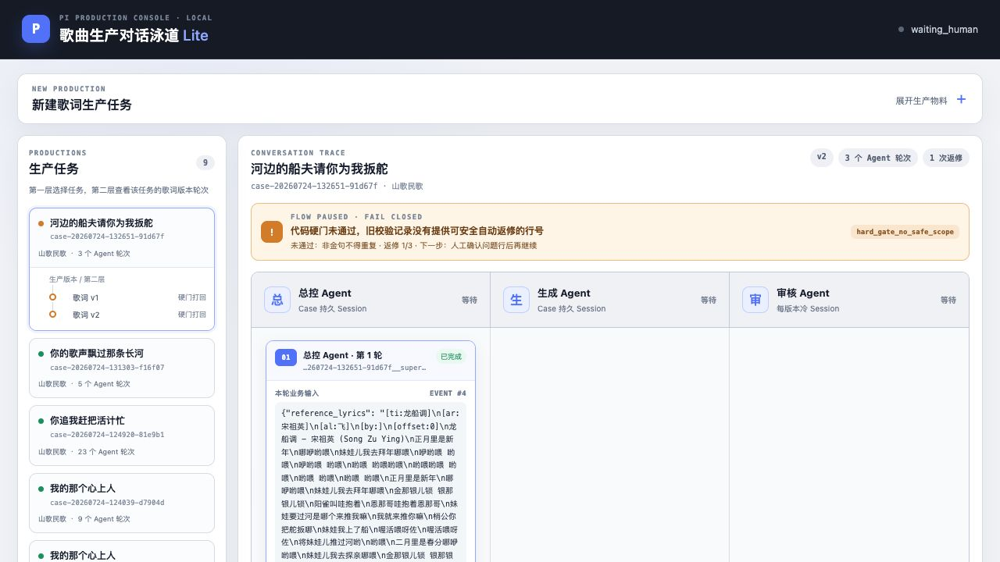
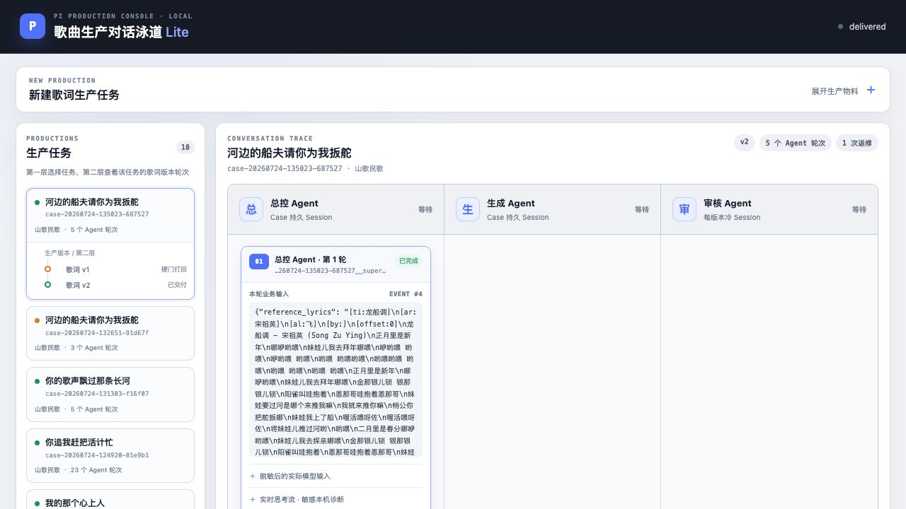

# 重复歌词返修阻断修复验收

验收日期：2026-07-24

修复提交：`7f30df85708317910c2fd12b77c7c90904b34131`

真实 Pi：`0.81.1`

## 结论

- 重复非金句现在会返回完整出现位置。
- 代码保留第一次出现，只把后续重复位置放入定点返修范围。
- 无法安全推导返修范围和返修预算耗尽使用不同阻断码。
- `waiting_human` 页面现在直接展示阻断原因、失败硬门、返修预算和后续流转状态。
- 自动化测试 32 项全部通过。
- 真实 Pi 回归 Case `case-20260724-135023-687527` 完成生成、代码返修、新审核 Session 冷审、总控终审并交付。

## 页面截图

旧真实 Case 的准确阻断状态：



修复提交上的真实 Pi 交付状态：



## 重复行专项回归

历史真实 Case：`case-20260724-132651-91d67f`

旧版本中的重复行：

```text
第3行  金那银儿锁 银那银儿锁
第15行 金那银儿锁 银那银儿锁
```

新校验结果：

```json
[
  {
    "text": "金那银儿锁 银那银儿锁",
    "positions": [3, 15]
  }
]
```

新代码推导的安全返修范围：

```text
[15]
```

因此第 3 行保持冻结，只允许修改后出现的第 15 行。自动化端到端测试同时验证了返修后 `changed_lines=[16]`、其他 15 行逐字冻结并进入冷审。

## 真实 Pi 回归

Case：`case-20260724-135023-687527`

关键 Agent 路由：

```text
用户 → 总控
总控 → 生成
代码硬门 → 生成
生成 → 审核
审核 → 总控
总控 → 交付
```

总控关键输出：

```text
任务：根据提供的《龙船调》参考歌词，以“河边的船夫请你为我扳舵”为金句，
创作一首山歌民歌风格的完整歌词。要求保留民歌对唱、问答的特色，语言生动自然。
```

代码返修输入：

```text
代码硬门拒绝歌词 v1。仅允许修改第 1,5,9,13 行，其他行逐字冻结。
```

审核关键输出：

```text
DECISION: APPROVE
AFFECTED_LINES: NONE
SCOPE: NONE
```

### 返修前完整歌词 v1

```text
河边的船夫请你为我扳舵
我要过河去拜年
你去哪家拜年呀
我去那外婆家里边

河边的船夫请你为我扳舵
我要过河去探亲
你去探哪个亲呀
我去看我的娘亲

河边的船夫请你为我扳舵
我要过河去采茶
你采茶给谁尝
给那情郎尝

河边的船夫请你为我扳舵
我要过河去会郎
你心中可欢畅
我心里喜洋洋
```

v1 硬门拒绝原因：金句出现在第 1、5、9、13 行，不满足只能出现在第 9、13 行。

### 返修后完整歌词 v2

```text
正月里是新年哪咿哟喂
我要过河去拜年
你去哪家拜年呀
我去那外婆家里边

二月里是春分哪咿哟喂
我要过河去探亲
你去探哪个亲呀
我去看我的娘亲

河边的船夫请你为我扳舵
我要过河去采茶
你采茶给谁尝
给那情郎尝

河边的船夫请你为我扳舵
我要过河去会郎
你心中可欢畅
我心里喜洋洋
```

实际变化只有第 1、5 行；其余 14 行逐字冻结。v2 六项代码硬门全部通过。

### Session 变化

```text
总控 Session
case-20260724-135023-687527__supervisor

生成 Session
case-20260724-135023-687527__generator

审核 Session
case-20260724-135023-687527__reviewer__v2__f333
```

生成 Agent 在 Case 内保持同一 Session；v2 使用新建审核 Session 冷审。

### 最终完整歌词

最终交付歌词与 v2 完全一致：

```text
正月里是新年哪咿哟喂
我要过河去拜年
你去哪家拜年呀
我去那外婆家里边

二月里是春分哪咿哟喂
我要过河去探亲
你去探哪个亲呀
我去看我的娘亲

河边的船夫请你为我扳舵
我要过河去采茶
你采茶给谁尝
给那情郎尝

河边的船夫请你为我扳舵
我要过河去会郎
你心中可欢畅
我心里喜洋洋
```

## 验证命令

```bash
.venv/bin/python -m unittest discover -s tests -v
python3 -m py_compile app/*.py tests/*.py
node --check static/app.js
```

结果：32 项测试通过，Python 与 JavaScript 语法检查通过，桌面和 390px 页面均无控制台错误或页面级横向溢出。

## 未解决问题

- 历史 Case `case-20260724-132651-91d67f` 保留原始 `waiting_human` 状态作为审计证据，不会被部署过程静默改写或自动续跑。
- 本次真实 Pi 重跑触发的是金句位置返修；重复行专项由历史真实产物重放和自动化端到端测试覆盖。
- 真实 Case 的 provenance 正确指向修复提交；`git_dirty=true` 是因为验收截图在运行前已生成但尚未纳入提交，不代表运行时代码与该提交存在差异。
